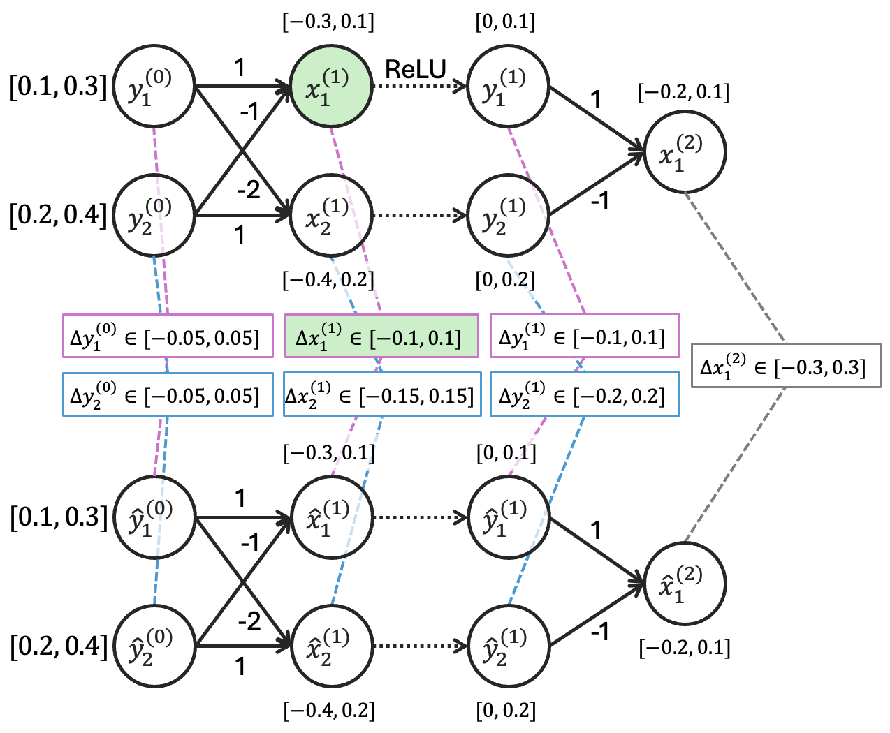
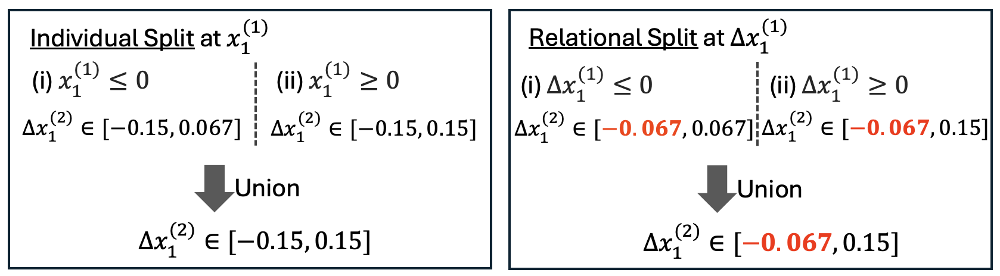

# SABRE: Splitting Approximated Bounds for Relational Verification

## Table of Contents
- [Installation Guide](#installation-guide)
- [Example in Section III-B](#the-example-in-section-iii-b)
- [Running Experiments](#running-experiments)
- [Project Structure](#project-structure)

## Installation Guide

### 1. Clone the repository
```
git clone https://github.com/fukky5341/sabre.git
cd sabre
```

### 2. Install Gurobi (solver)
Please install Gurobi from the official website: [gurobi installation](https://www.gurobi.com/)

Ensure that your Gurobi license is properly installed and gurobipy works in Python.

### 3. Install uv (python environment manager)
Please install by following guide: [uv installation](https://github.com/astral-sh/uv?tab=readme-ov-file#installation)


### 4. Setup python version
The project requires Python 3.12. Please install and pin the version using uv:
```
uv python install 3.12
cd [repository folder]
uv python pin 3.12
```

### 5. Create uv environment and install dependencies
```
uv sync
```
This command:
- creates a virtual environment (.venv)
- installs all dependencies from `pyproject.toml`
- ensure the environment uses Python 3.12


## Example in Section III-B
The details of the example in Section III-B are provided in [example](example/example.ipynb). You can run the notebook to visualize the bounds and splitting process.

<figure>
    
    <figcaption>Figure 1: Relational backsubstitution in example 1 in Section III-B.</figcaption>
</figure>
<figure>
    
    <figcaption>Figure 2: Individual and Relational splitting comparison in example 1 in Section III-B.</figcaption>
</figure>


## Running Experiments
### Binary Search (RQ4)
To run the binary search experiments:
```
uv run run_experiment_bs.py
```
In this experiment, we compare the performance of our method SABRE (RS_dual_Z) with baselines: RaVeN (base), ClasIS (IS_dual_ind), DualIS (IS_dual), and RandRS (RS_random_Z) via binary search on ACAS Xu, MNIST-F, MNIST-C, CIFAR. In binary search, each approach explores the maximum verifiable input relational distance.

The results and logs are generated in `experiment_results/binary_search`. The processing status are written to the log files, and the final result is given at the bottom of the log file.

### RQ1-RQ3
To run the experiments used in RQ1-RQ3:
```
uv run run_experiment_rs_is.py
```
In this experiment, we compare the performance of our method SABRE (RS_dual_Z) with baselines: RaVeN (base), ClasIS (IS_dual_ind), DualIS (IS_dual), and RandRS (RS_random_Z) on ACAS Xu, MNIST-F, MNIST-C, CIFAR. For a given instance with output relational threshold, we evaluate whether each approach can verify or find counterexamples for the instance within the time limit.

The results and logs are generated in `experiment_results/` network-wisely. The processing status are written to the log files, and the final result is given at the bottom of the log file.


## Project Structure
```
sabre/
 ├─ run_experiment_bs.py    # Entry point for binary search experiments
 ├─ run_experiment_rs_is.py    # Entry point for experiments
 ├─ example/    # Example used in Section III-B
 ├─ relational_bounds/    # Relational bound propagation modules
 ├─ relu/    # Handle ReLU transformation in relational bound propagation
 ├─ relational_split/    # Branch-and-bound with relational splitting
 ├─ individual_split/    # Branch-and-bound with individual splitting
 ├─ relational_property/    # LP formulation for relational properties
 ├─ dual/    # Dual formulation for neuron selection
 ├─ (common, data, network_converters, ...)/  # Common utilities, datasets, and network converters
 ├─ pyproject.toml    # Project dependencies
 └─ README.md
```