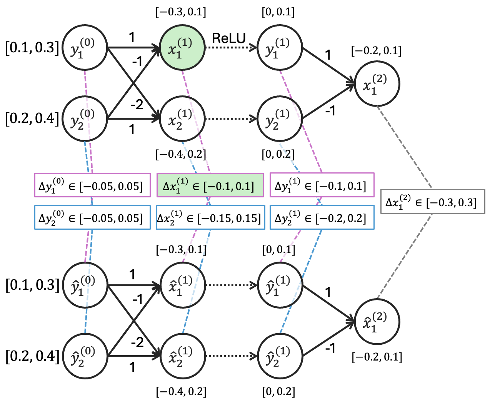
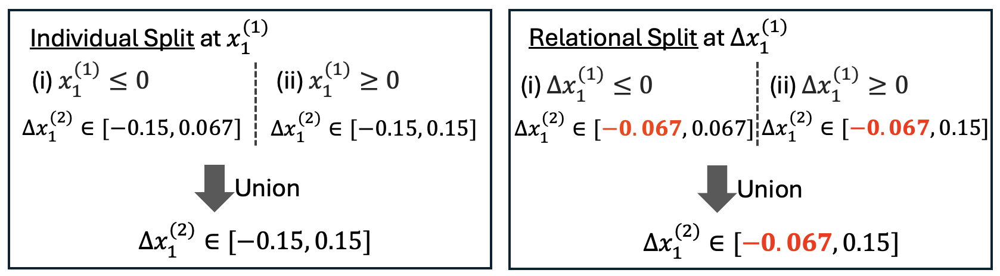

# SaBRe: Splitting Approximated Bounds for Relational Verification (ARTIFACT)


## Authors
- Kota Fukuda (Kyushu University, Japan)
- Zhenya Zhang  (Kyushu University, Fukuoka, Japan National Institute of Informatics, Tokyo, Japan)
- Guanqin Zhang (UNSW & CSIRO's Data61, Sydney, Australia)
- Jianjun Zhao  (Kyushu University, Fukuoka, Japan)


## Paper
[Branch and Bound for Relational Verification of Neural Networks](EMSOFT_26.pdf)

## Important Note
- The verifiers were primarily developed and tested on Linux.
- Verification is NP-complete and can therefore require substantial computation time. 


## Table of Contents
- [Badges](#badge-status)
- [Installation Guide](#installation-guide)
- [Illustrative Example](#illustrative-example)
- [Running Experiments](#running-experiments)
- [Reproduction of Figures and Tables in the Paper](#reproduction-of-figures-and-tables-in-the-paper)
- [Project Structure](#project-structure)


## Badge Status

We apply for the following artifact badges.

- Available
- Reviewed
- Reproducible

The details are described in [STATUS.md](STATUS.md).


## Installation Guide

Requirements for running the project are described in [REQUIREMENTS.md](REQUIREMENTS.md). The installation guide is provided in [INSTALL.md](INSTALL.md). Here we provide a quick start guide using Docker. For installation from scratch, please refer to [INSTALL.md](INSTALL.md).


### Quick Commands

| Goal | Command / File | Description |
|------|----------------|-------------|
| Verify installation | `uv run run_experiment_rs_is.py --quicktest` | Runs a small verification example to confirm the environment is correctly configured. |
| Reproduce RQ1, RQ2, RQ4 | `uv run run_experiment_rs_is.py` | Executes the main relational verification experiments. |
| Reproduce RQ3 | `uv run run_experiment_dp.py` | Runs experiments on varying numbers of perturbed input dimensions. |
| Reproduce RQ5 | `uv run run_experiment_bs.py` | Runs binary-search experiments for maximum verifiable relational distance. |
| Generate all figures and tables | `evaluation/analysis.ipynb` | Produces the figures and tables from the experimental results. |


### Quick Start with Docker

**Step 1: Pull the image**

```bash
docker pull fukky5341/sabre:latest
```

**Step 2: Prepare a Gurobi license**

The Docker image already contains all project files and dependencies. The only external requirement is a valid Gurobi license, which must be mounted into the container.

Please follow the instructions in
[INSTALL.md #Gurobi-License](INSTALL.md#install-gurobi-solver)
to obtain and configure a license.

**Step 3: Run the container**

```bash
docker run \
  -it \
  -p 8888:8888 \
  -v /path/to/gurobi.lic:/licenses/gurobi.lic \
  -e GRB_LICENSE_FILE=/licenses/gurobi.lic \
  fukky5341/sabre:latest
```

Replace `/path/to/gurobi.lic` with the location of your own license file.

**Step 4: Verify the installation**

```bash
uv run run_experiment_rs_is.py --quicktest
```

The smoke test uses a single small verification instance and typically completes within a few minutes. If the installation is successful, the output ends with:

```text
** Run mnistF quicktest **
Running quicktest with d_eps=1, i_eps=2, RS/IS mode=RS_random_Z
execution: (d:1, i:2, idx:0)

...

Done!
```

A detailed execution log is also generated at:

```text
nnRelationalVerify/experiment_result/mnistF/RS_random_Z_threshold/d1_e2/0/log.md
```

The log contains the execution arguments, intermediate verification results, and the final verification status.


### Installation Guide from Scratch

If you want to install the project from scratch, the installation guide is provided in [INSTALL.md](INSTALL.md).


### Running the Jupyter Notebook

```bash

docker run \
  -it \
  -p 8888:8888 \
  -v /path/to/gurobi.lic:/licenses/gurobi.lic \
  -e GRB_LICENSE_FILE=/licenses/gurobi.lic \
  fukky5341/sabre:latest
```

Inside the container, launch JupyterLab:
```bash
uv run jupyter lab --ip=0.0.0.0 --port=8888 --no-browser --allow-root
```

After starting JupyterLab, you can access it in either of the following ways.
Copy and open the URL printed in the terminal, for example: `http://127.0.0.1:8888/lab?token=<TOKEN>`.

In the browser, you can find the contents of this repository and run the notebook.


## Illustrative Example
The details of the example in Section III-B is provided in [nnRelationalVerify/example](nnRelationalVerify/example/example.ipynb). You can run the notebook to follow the bound propagation and visualize them and splitting process.

<figure>
    
    <figcaption>Figure 1: Relational backsubstitution in example 1 in Section III-B.</figcaption>
</figure>
<figure>
    
    <figcaption>Figure 2: Individual and Relational splitting comparison in example 1 in Section III-B.</figcaption>
</figure>


## Running Experiments

In the scripts and log files, we use the following names for the baseline methods and SaBRe.
- `RS_random_Z`: RandRS
- `IS_dual_ind`: ClasIS
- `IS_dual`: DualIS
- `RS_dual_Z`: SaBRe


### RQ1, RQ2, RQ4
To run the experiments used in RQ1, RQ2, and RQ4:  
Example (single network)
```
uv run run_experiment_rs_is.py --networks gtsrb --num 1
```
or  
Example (multiple networks)
```
uv run run_experiment_rs_is.py --networks gtsrb cifar mnistF mnistC acasxu --num 1
```
**CLI arguments:**
As command line arguments, you can specify the networks to run experiments on and the number of instances to run for each network, method, and input perturbation. Omitting `--num` runs all instances used in the paper.

The runtimes below correspond to the full experiments used in the paper. For a smaller evaluation run, use `--num 1`, which restricts the number of instances for each network, method, and input perturbation setting.

**Runtime:**
Full experiments for RQ1, RQ2, and RQ4 take a long time to finish due to the computational complexity of relational verification.

| Network | Max. Runtime (hours) |
|---------|----------------------|
| GTSRB   | 210 h                |
| CIFAR   | 528 h                |
| MNIST-F | 78 h                 |
| MNIST-C | 78 h                 |
| ACAS Xu | 84 h                 |


**Experiment description:**
In this experiment, we compare SaBRe (RS_dual_Z) with the baseline methods: RaVeN (base), ClasIS (IS_dual_ind), DualIS (IS_dual), and RandRS (RS_random_Z) on GTSRB, CIFAR, MNIST-F, MNIST-C, and ACAS Xu. For a given instance with output relational threshold, we evaluate whether each approach can verify or find counterexamples for the instance within the time limit.

**Results and logs:** 
The results and logs are generated in `experiment_result/` for each network. The experiment arguments and processing status are written to the log files, and the final result is given at the bottom of the log file.

For example, the log file for a single GTSRB instance performed by SaBRe is `nnRelationalVerify/experiment_result/gtsrb/RS_dual_Z_threshold/d1_e2/0/log.md`, where `d1_e2/0` indicates $d_{eps}=1$, $i_{eps}=d_{eps}*2=2$, and running index is $0$. The log file contains the execution arguments, intermediate results including the unstable ReLU counts, BaB splitting process, and the final result as follows:
```
## Execution arguments:
Dataset: Dataset.GTSRB
Network: onnx/gtsrb_cnn.onnx
Relational property: GLOBAL_ROBUSTNESS
LP Analysis: True
Epsilon: 0.0078125
Delta epsilon: 0.00390625
execution index: (1, 2, 0)
Time budget: 1800 seconds
Split limit: 100
Threshold: 2.2057107072

...(log for root parent node)...

## BASE Relational Analysis

## BASE Result
execution time: IAR + RelationalAnalysis = 2.70 + 12.80 = 15.50 seconds
status: Status.VERIFIED
relational distance
Output dim: 12, lower bound: -2.2035072, upper bound: 2.2035072

(... more intermediate results and BaB splitting process if bab is needed ...)
```

### RQ3
To run the experiments for the comparison on the different number of dimensions to perturb:
```
uv run run_experiment_dp.py
```

**Runtime:**
Full experiments for RQ3 take approximately $324,000$ seconds (90 hours) for all instances.

**Experiment description:**
In this experiment, we compare the performance of our method SaBRe (RS_dual_Z) with baselines: ClasIS (IS_dual_ind) and DualIS (IS_dual) on MNIST-F. 

**Results and logs:**
The results and logs are generated in `experiment_result/mnist-256x4-dp`. The experiment arguments and processing status are written to the log files, and the final result is given at the bottom of the log file.

For example, the log file for a single instance with perturbation ratio `p^%`$=0.25$ performed by SaBRe is `nnRelationalVerify/experiment_result/mnist-256x4-dp/RS_dual_Z_dimperturb_0.25_threshold/d2_e3/2/log.md`, where `d2_e3/2` indicates $d_{eps}=2$, $i_{eps}=d_{eps}*3=6$, and running index is $2$. The log file contains the execution arguments, intermediate results including the unstable ReLU counts, BaB splitting process, and the final result as follows:
```
## Execution arguments:
Dataset: Dataset.MNIST
Network: onnx/mnist-net_256x4.onnx
Relational property: GLOBAL_ROBUSTNESS
LP Analysis: True
Epsilon: 0.0234375
Delta epsilon: 0.0078125
execution index: (2, 3, 1)
Time budget: 600 seconds
Split limit: 100
Threshold: 0.00018056

...(log for root parent node)...

## BASE Result
execution time: IAR + RelationalAnalysis = 1.39 + 1.47 = 2.86 seconds
status: Status.UNKNOWN
relational distance
Output dim: 6, lower bound: -0.0002120, upper bound: 0.0002119

# Relational Split (RS) starts

...(BaB splitting process and intermediate results)...

## RS Result
status: Status.VERIFIED
execution time: (base) + (rs) = 2.86 + 47.57 = 50.43 seconds
```

### RQ5
To run the binary search experiments:  
Example (single network)
```
uv run run_experiment_bs.py --networks gtsrb
```
or

Example (multiple networks)
```
uv run run_experiment_bs.py --networks gtsrb cifar mnistF mnistC acasxu
```

**CLI arguments:**
As command line arguments, you can specify the networks to run experiments on. 

**Runtime:**
Full experiments for RQ5 take approximately $5,686,800$ seconds to finish. 

**Experiment description:**
In this experiment, we compare the performance of our method SaBRe (RS_dual_Z) with baselines: RaVeN (base), ClasIS (IS_dual_ind), DualIS (IS_dual), and RandRS (RS_random_Z) via binary search on ACAS Xu, MNIST-F, MNIST-C, CIFAR. In binary search, each approach explores the maximum verifiable input relational distance.

The results and logs are generated in `experiment_result/binary_search`. The experiment arguments and processing status are written to the log files, and the final result is given at the bottom of the log file.

For example, the log file for a single GTSRB instance performed by SaBRe is `nnRelationalVerify/experiment_result/binary_search/gtsrb_2_4/RS_dual_Z/0/log.md`, where `gtsrb_2_4` indicates $d_{eps}=2$, $i_{eps}=d_{eps}*4=8$, and running index is $0$. The log file contains the execution arguments, intermediate results including the unstable ReLU counts, BaB splitting process, binary search exploration process, and the final result as follows:
```
## Execution arguments:
Dataset: Dataset.GTSRB
Network: onnx/gtsrb_cnn.onnx
Epsilon: 0.046875
Initial delta epsilon: 12
Time budget: 18000 seconds
Threshold: 45.034503
Search space: {k/256.0 | k = 1, 2, ..., 12}

...(log of binary search for root node (no splitting))...

## Binary Search Result
Binary search time: 541.41 seconds
BS Status: Status.VERIFIED
Maximum delta epsilon: 0.0078125


# Individual Split (IS_dual) starts
Time budget: 17389.78 seconds

...(BaB splitting process and intermediate results of each binary search step)...

## Binary Search with RS_dual_Z Result
status: Status.VERIFIED
Maximum delta epsilon: 0.0078125
execution time: 12287.05 seconds
```


## Reproduction of Figures and Tables in the Paper
We provide all the necessary scripts and configurations to reproduce the figures and tables in the paper. 

**Note**:  The results generated by the artifact may differ slightly from those reported in the paper. After conducting the experiments for the paper, we refactored and cleaned the artifact code for release. These changes, together with machine-dependent numerical differences, can lead to small variations in the verification results. 

Nevertheless, the reproduced results are consistent with those reported in the paper. In particular, the overall quantitative trends, relative comparisons between methods, and conclusions of the experimental evaluation remain the same. Therefore, reproduction recovers the same experimental observations and conclusions, although individual numerical values may not be identical.

The analysis scripts are located in `evaluation`. The notebook [evaluation/analysis.ipynb](evaluation/analysis.ipynb) generates the figures and tables from the processed results in `nnRelationalVerify/result/`.

Two options are provided:

- Option 1 (recommended): Use the precomputed results.  
The artifact includes precomputed results in `nnRelationalVerify/result/`.
Running the notebook [evaluation/analysis.ipynb](evaluation/analysis.ipynb) using these results generates the figures and tables listed below. The generated results may differ slightly from the corresponding values in the paper for the reasons described above, but they should exhibit the same overall results, comparisons, and conclusions.
- Option 2: Rerun the experiments.  
Run the experiments following the instructions in Section [Running Experiments](#running-experiments).
After the experiments are completed, replace the contents of `nnRelationalVerify/result/` with your generated results `nnRelationalVerify/experiment_result/` before executing the notebook. Because verification results can be affected by machine-dependent numerical behavior, results obtained on a different machine may also differ slightly from both the provided precomputed results and the values reported in the paper.


### Figures and Tables Guide
Here we show the list of figures and tables you can reproduce by running the notebook (all figures and tables are generated by the functions in the [notebook](evaluation/analysis.ipynb)):
- **Figure** 3: instance distribution, generated by `draw_figures.get_subproblems_distribution(...)` in the early notebook cells.
- **Table III (RQ1)**: comparison of RaVeN and SaBRe, generated by `analysis.analyze_with_base(...)` and related table helpers.
- **Table IV (RQ2)**: comparison of individual splitting and relational splitting methods, generated by `analysis.get_table_Nsolved_timeRatio(...)` with `['NSInd', 'NS', 'DS_dual_Z']`.
- **Figure 4 (RQ2)**: boxplots, generated by `draw_figures.draw_boxplot()`.
- **Figure 5 (RQ2)**: bar chart of solved instances, generated by `line_graph.plot_bar_solved_all(filter_d=None)`.
- **Table V (RQ2)**: CIFAR perturbation-distance comparison, generated by `analysis.get_solved_num_and_timeratio_on_d(cifar10, "cifar10")`.
- **Table VI and Table VII (RQ3)**: different number of dimensional-perturbation analysis tables, generated by `analysis_dp.dp_tables()`.
- **Table VIII (RQ4)**: comparison of relational neuron selection strategy, generated by `analysis.get_table_Nsolved_timeRatio(...)` with `['DS_random_Z', 'DS_dual_Z']`.
- **Figure 6 (RQ5)**: pairwise comparison plots for verifiable distance, generated by `binary_search.plot_epsilon_ratio_boxplot_all(cap=10, log_scale=False)`.
- **Figure 7 (RQ5)**: binary-search statistical summary, generated by `binary_search.statistical_analysis_merge()`.


## Project Structure and File Descriptions
We point out the noteworthy components and their locations. The project structure is as follows:
```
sabre/
 ├─ README.md
 ├─ STATUS.md    # Artifact badge status
 ├─ REQUIREMENTS.md    # Requirements for running the project
 ├─ INSTALL.md    # Installation guide from scratch
 ├─ LICENSE
 ├─ Dockerfile
 ├─ .dockerignore
 ├─ pyproject.toml    # Project dependencies
 ├─ .python-version    # Python version used in the project
 ├─ uv.lock    # Lock file for uv
 ├─ run_experiment_rs_is.py    # Entry point for general experiments for relational verification
 ├─ run_experiment_bs.py    # Entry point for binary search experiments
 ├─ run_experiment_dp.py    # Entry point for experiments on different number of dimensional-perturbation analysis
 ├─ nnRelationalVerify/    # Main implementation of SaBRe and baselines
 └─ evaluation/    # Scripts and notebooks to produce the figures and tables

```

**nnRelationalVerify** contains the main implementation of SaBRe and baselines. The main modules are as follows:
- `example/`: Example used in Section III-B
- `relational_bounds/`: Relational bound propagation modules
- `relu/`: Handle ReLU transformation in relational bound propagation
- `relational_split/`: Branch-and-bound with relational splitting
- `individual_split/`: Branch-and-bound with individual splitting
- `relational_property/`: LP formulation for relational properties
- `dual/`: Dual formulation for neuron selection
- `(common, data, network_converters, ...)`: Common utilities, datasets, and network converters

**evaluation** contains the scripts and notebooks to produce the figures and tables in the paper. The main modules are as follows:
- log_to_csv.py    # Generate CSV files from experiment logs for RQ1, RQ2, RQ4
- generate_csv_dp.py    # Generate CSV files for RQ3
- analysis.py    # Analysis functions for RQ1, RQ2, RQ4
- analysis_dp.py    # Analysis functions for RQ3
- binary_search.py    # Analysis functions for RQ5
- draw_figures.py    # Drawing functions for figures in the paper
- analysis.ipynb    # Notebook to reproduce the figures and tables in the paper
